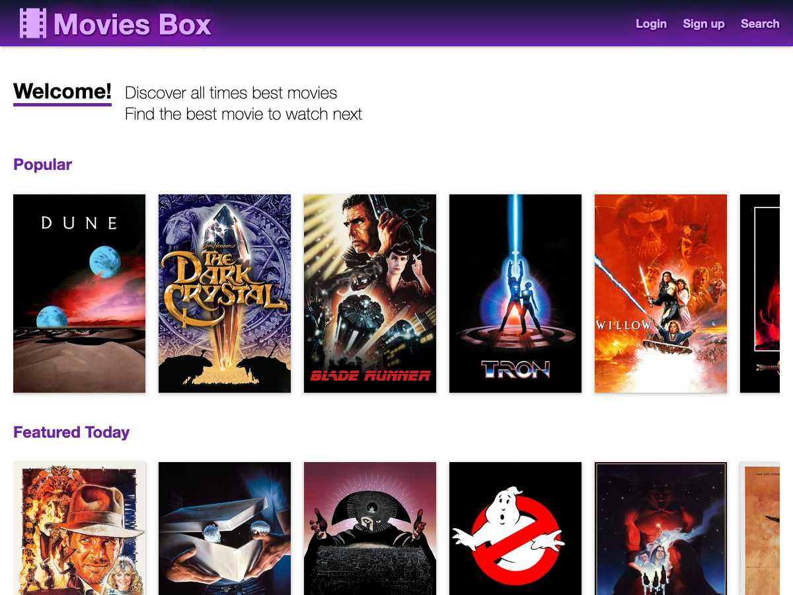

<picture>
    <source media="(prefers-color-scheme: dark)" srcset="docs/assets/img/movies-box-dark.png" > 
    <source media="(prefers-color-scheme: light)" srcset="docs/assets/img/movies-box-light.png" > 
    
</picture>


# Movies Box, a Hurl Tutorial

[](https://github.com/jcamiel/hurl-express-tutorial/actions)
[](https://jcamiel.github.io/hurl-express-tutorial/)

"Movies Box" is a sample project to demonstrate the use of [Hurl].
Hurl is a CLI tool to run and test HTTP requests. Hurl is used to write integration tests for HTML site, REST APIs, 
GraphQL APIs etc... 

Hurl can be used with various frameworks; in this sample, "Movies Box" is developed using [Express], a web framework for
Node.js.  


## Run Project

```shell
$ npm install
$ npm start
...
Create user username: bob78 email: bob78@example.net
Create user username: fab email: fab@example.net
Listening on port 3000
```

You can create a new user, of play with an existing one like `user=fab`, `password=12345678`

## Unit test && Format

```shell
$ npm test
```

```shell
$ npm run fmtcheck
$ npm run lint
```

## Docker Image

The latest version of "Movies Box" is published as a Docker image. To run it:

```shell
$ docker pull ghcr.io/jcamiel/hurl-express-tutorial:latest
$ docker run --name movies --rm --detach --publish 3000:3000 ghcr.io/jcamiel/hurl-express-tutorial:latest
```

## Running Integration Tests

```shell
$ hurl --variable host="http://localhost:3000" --test integration
```

[Hurl]: https://hurl.dev
[Express]: https://expressjs.com
